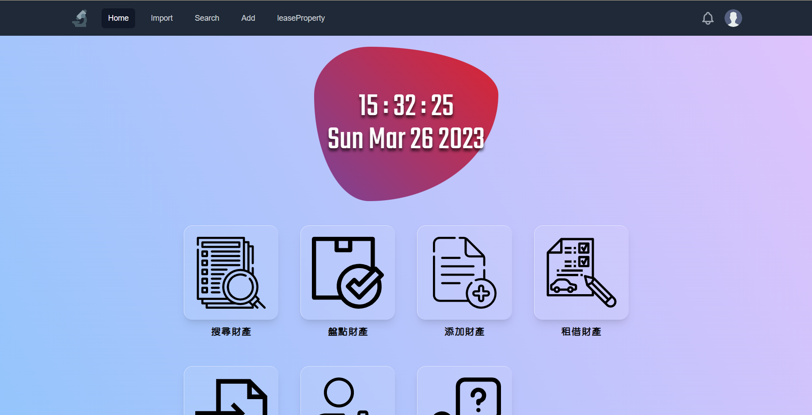

# PropertyCheckSystem網站建置



1. [使用](#使用)
1. [安裝](#安裝)
1. [執行](#執行)
1. [開始部屬](#)

## 使用
可以參考此篇文章使用
[使用教學](https://hackmd.io/5qiim1AbSYeLNpIUu-mMNQ)

## 安裝
### 後端環境
> channels
> Django
> Node.js (僅安裝tailwind)
> tailwind (透過npm安裝)

### 資料庫
> 10.5.9-MariaDB

### 前端環境
> Vue.JS 3.0.11

### 環境變數
- WEB_DB_NAME default is pandian
- WEB_DB_USER default is root
- WEB_DB_PW   default is root
- WEB_DB_ADDR default is 127.0.0.1
- WEB_DB_PORT default is 3306

### 安裝MySQL or MariaDB
``` shell
# 安裝MySQL
sudo apt install mysql-server
sudo apt install mysql-client
sudo apt install libmysqlclient-dev
# 初始設定
sudo mysql_secure_installation
```
[Access denied問題](https://www.notion.so/MySQL-access-cf0e58a320eb4060b818d4f35a88e569)

### Debian需要的套件
``` shell
sudo apt install libsasl2-dev python3-dev libldap2-dev libssl-dev libmysqlclient-dev
sudo apt-get install build-essential slapd ldap-utils tox lcov valgrind
```

### python需要的套件
``` shell
pip install django==3.2.18
pip install python3-ldap django_auth_ldap django_werkzeug_debugger_runserver django_extensions channels mysqlclient pillow
```

## 執行
### 使用django內部伺服器執行
``` shell
# 首次執行需要先初始話資料庫
python manage.py makemigrations
python manage.py migrate
# 創建SuperUser
python manage.py createsuperuser
# 執行伺服器監聽所有IP於80 port
python manage.py runserver 0.0.0.0:80
```